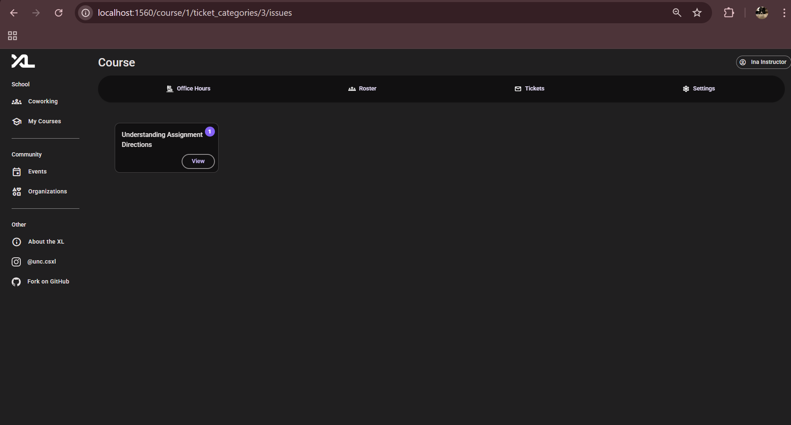
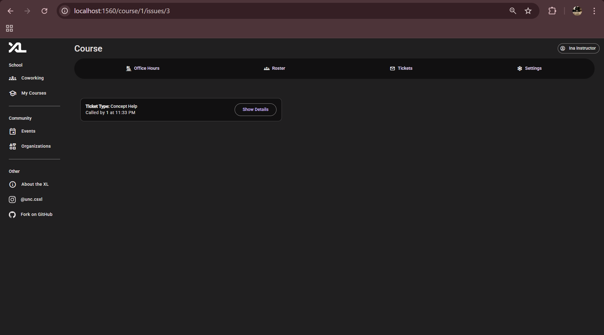
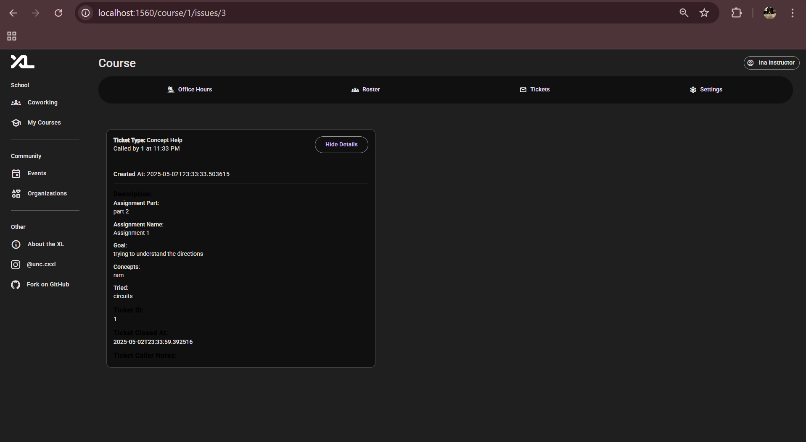

### Ticket Widget Analysis

Authors: Trisha Samavedam, Cassidy Lowe, Simon Felt, Daniel Ramsgard

### Overview

The Ticket Analysis Application was split into three main components. Tickets were grouped by Assignment. Within each assignment, tickets were grouped by Issue, and within each issue Instructors and Teaching Assistants were able to view each ticket that pertained to a specific Issue.

### Backend

### Services

The Backend handled fetching and storing data from and to the ticket database, as well as, sending and getting information from the http front end. This was accomplished through both services and models.

### OpenAI Integration

A crucial part of our application design was our ability to harness the power of AI to categorize tickets into common themes and issues. To do this, we created two API services that handled our backends interaction with OpenAI. Specifically, we used the openai_svc dependency_injected service to communicate with OpenAI. Everytime a ticket was created, it was sent to OpenAI to be categorized. This was done using the following code to fetch issues `self._session.query(IssueEntity).filter(IssueEntity.ticket_category_id == office_hours_ticket.ticket_category_id).all().` If the category returned was similar to existing categories, the ticket was added to an existing issue, however, if it was a new category, a new issue was created and the ticket was placed there.

The following models were used in this service:
OfficeHoursTicket: Input model containing a ticket description and category.

`IssueEntity`: Represents a category or sub-topic under which tickets can be grouped.

`TicketCategoryEntity`: A higher-level category (e.g., an assignment).

`OpenAITestResponse`: Response object from GPT, includes:

`new_category`: bool

`category`: str

In addition, an example prompt sent to OpenAI is: Your task is to classify office hour tickets...
You must choose the best-fit category from the list below:
(Git conflicts, Docker issues, ...)
Ticket: (Student can’t resolve merge conflicts...)

# Ticket Data Access Methods

The rest of our services located in the office_hours.py file dealt with fetching the assignments, issues, and ticket groups. These methods used the existing Ticket database and SQLAlchemy and returned structured data models.

---

Method: `get_all_assignments_concepts(course_id: int)`

This method retrieves all the ticket categories (all the assignments for assignments, and all the unique concepts for concepts). Each category has a name, a number of issues within that category, and a link to the issues for that category. The main argument for this method was the course_id.

Method: `get_all_issues(assignment_id: str)`

This method retrieves all the issues for a given assignment or concept category. Each issue has a name, a number of tickets within that issue, and a link to the issues for that category. The main argument for this method was the assignment_id.

Method: `get_all_tickets_by_issue(issue_id: str)`

This method retrieves all the tickets for a given issue. The main argument for this method was the issue_id.

### Models

We used three main models: assignment-concepts, issues, and tickets.

# Backend Models

## Model: `AssignmentConcept`

`class AssignmentConcept(BaseModel):
    id: int
    name: str
    category: Literal[TicketType.ASSIGNMENT_HELP, TicketType.CONCEPTUAL_HELP]
    course_site_id: int
    num_issues: int | None = None`

This model held all our assignment and concpetual categories and their data.

class Issue(BaseModel):
"""
Pydantic model to represent an `AssignmentIssue`.

    This model stores the data for an assignments issues.
    """
    id: int | None
    name: str | None
    ticket_category_id: int | None
    num_tickets: int | None = None

This model was used for all our issues to store the associated issue data.

`export interface Ticket {
  description: string;
  type: number;
  office_hours_id: number;
  id: number;
  state: number;
  created_at: string; // ISO timestamp
  called_at: string; // ISO timestamp
  closed_at: string | null; // Nullable ISO timestamp
  have_concerns: boolean;
  caller_notes: string;
  caller_id: number;
}`

We used this interface to display and store all the above information about each ticket that was created.

### Frontend

The ticket analysis application is composed of three distinct Angular Components, the assignments-concept component, the issue-component, and the assignments-concepts page. In addition we also had frontend services.

The Assignments Concepts page is the first page of our application. This component utilised the `/routes` API Route to fetch all the assignments and concepts using the API backend service `.getAllAssignmentsConcepts`, passing the courseID as an argument. This component utilised Angular signals to fetch and store the respective assignments and concepts and store them in two respective lists. This component imported the AssignmentCardWidget to display each assignment with a routed "View" button that took the user to an issues page for the respective assignment.

Assignment Concepts Page: 

the Issues page is the second page in our application that details all the common issues within a respective concept/assignment. The issues component utilised the `ticket_categories/:ticket_category_id/issues`' route to direct to a sepcific ticket category and fetched those issues using the API backend service `.getAllTickets(this.ticket_category_id).` This component also utilised the IssueCard Widget which to display each issue within an assignment with a routed "View" button that took the user to a page with all the tickets contained within that issue.

Issues Page: 

The Group page hosts all the tickets that are categorized within a specific issues. The group component utilised the` issues/:issue_id'` route to route to a specific issue's tickets. This used the API Backend service `.get_all_tickets_by_issue(issue_id: str)`. In addition, it used the TicketCardWidget to display all the information associated with a specific ticket. The TicketCardWidget is a modified version of the original CalledTicketWidget used in the office-hours component. In addition, we made our TicketCardWidget expandable to enable instructors and TA's to easily glance at a ticket at first, but also recover more information if needed.

Ticket Group Page: 
Expandable Ticket: 
